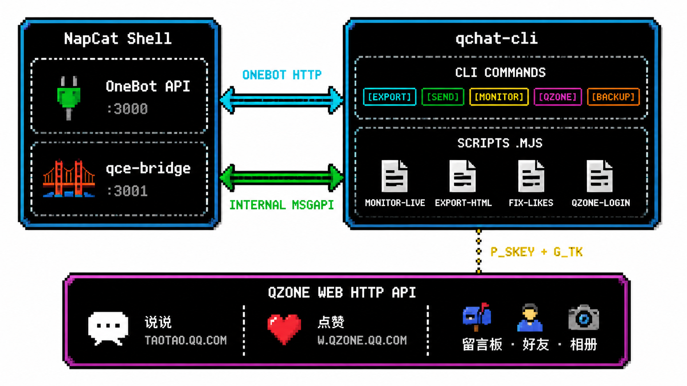

<div align="center">

# qchat-cli

*QQ Chat Operations CLI — Export, Send, Monitor, Reply, QZone.*

> 今人不见古时月，今月曾经照古人

</div>

---

## ✨ v0.2.0 — QZone Integration

- ✨ **QZone API 客户端** — 扫码登录、说说拉取/发布/删除、点赞、评论、好友、访客、留言板、相册
- ✨ **QZone CLI 子命令** — `qce qzone` 系列命令覆盖全部空间操作
- ✨ **QZone 运维脚本** — 批量补赞、全量说说导出、点赞状态检查
- 🐛 **分页漏帖修复** — `pos += batch.length` 替代固定步进，解决 80% 帖子被跳过的问题
- 🔧 **文档重构** — 新增 WORKFLOW-REPORT.md 全流程记录 + USAGE.md 人机协作使用指南

[完整变更记录 →](https://github.com/zhuobichen/qchat-cli/commits/master)

---

## Welcome

**qchat-cli** is the devops toolkit for QQ chat — a CLI tool and script suite that wraps NapCatQQ's OneBot protocol for message export, delivery, monitoring, auto-reply, and full QZone space management.

**qchat-cli** 是 QQ 聊天运维 CLI 工具。基于 NapCatQQ 的 OneBot 协议封装了消息导出、发送、监听与自动回复，并完整集成了 QZone 空间 Web API。

---

## Feature

- **OneBot Message Export** — 多格式导出（JSON / TXT / Markdown / HTML / CSV），含图片 base64 内嵌
- **Full History via qce-bridge** — 绕过 OneBot 200 条限制，msgId 分页拉取完整聊天记录
- **Live Monitor & Auto-Reply** — 3s 轻量轮询，基于 `identity.md` 人格文档自动回复
- **Safe Send with Whitelist** — 白名单 + 确认机制，防止 AI 误发消息
- **QZone Full Integration** — 扫码登录、说说/点赞/评论/留言板/相册/好友/访客全部可操作
- **Bulk Like & Feed Export** — 一键补赞、全量说说导出、点赞状态批量检查

---

## Quick Start

> 前置要求：Node.js 18+，NapCatQQ 已部署并运行

```bash
git clone https://github.com/zhuobichen/qchat-cli.git
cd qchat-cli
npm install && npm link
```

```bash
qce login --host localhost --port 3000   # 连接 NapCat
qce login --test                         # 测试连接
qce export <QQ号> --format html          # 导出聊天记录
qce qzone login                          # 扫码登录 QZone
qce qzone feeds <QQ号>                   # 查看说说
```

> ⚠️ **首次使用前请阅读 [USAGE.md](./USAGE.md)** — Part B 列出人类需要手动操作的步骤（启动 NapCat、扫码等），AI 无法代劳。

---

## Command Reference

### OneBot

| 命令 | 说明 |
|------|------|
| `qce login --host <H> --port <P>` | 配置 NapCat 连接 |
| `qce list friends \| groups` | 查看好友/群组列表 |
| `qce export <QQ号> [--format json\|md\|html]` | 导出聊天记录 |
| `qce send <QQ号> "消息"` | 发送消息 |
| `qce safety allow\|deny <QQ号>` | 白名单管理 |
| `qce monitor start <QQ号> [--auto-reply]` | 启动监听+自动回复 |
| `qce backup --add <QQ号>` | 定时备份 |

### QZone

| 命令 | 说明 |
|------|------|
| `qce qzone login \| logout` | 扫码登录 / 登出 |
| `qce qzone me \| user <QQ号>` | 查看空间信息 / 用户名片 |
| `qce qzone feeds [QQ号] [-n 20]` | 查看说说列表 |
| `qce qzone post "内容" \| delete <tid>` | 发说说 / 删说说 |
| `qce qzone like <tid>` | 查看点赞数 |
| `qce qzone comments <tid> [QQ号] [-n 20]` | 查看评论（含回复） |
| `qce qzone comment <QQ号> <tid> "内容"` | 评论说说 |
| `qce qzone friends \| visitors \| albums` | 好友 / 访客 / 相册 |
| `qce qzone board [QQ号] [-n 10]` | 留言板 |

### Scripts (通用工具)

| 脚本 | 用途 |
|------|------|
| `npx tsx export-html.mjs <QQ号>` | 完整聊天历史 → HTML（图片内嵌） |
| `npx tsx export-full-history.mjs <QQ号>` | 完整聊天历史 → Markdown |
| `npx tsx export-qzone-feeds.mjs [QQ号]` | 导出 QZone 说说+评论为 HTML |
| `npx tsx qzone-login.mjs` | QZone 独立扫码登录 |

### Scripts (隐私操作 · `private/`)

带 QQ 号等私密信息的脚本放在 `private/` 目录，**不提交 Git**。

使用前先配置：`cp private/config.example.json private/config.json`

| 脚本 | 用途 |
|------|------|
| `npx tsx private/qzone-ops.mjs export <名>` | QZone 说说+评论导出 |
| `npx tsx private/qzone-ops.mjs check <名>` | 检查点赞状态 |
| `npx tsx private/qzone-ops.mjs like <名>` | 检查+补赞 |
| `npx tsx private/monitor-live.mjs` | 实时监听+人格回复 |
| `npx tsx private/monitor-notify.mjs` | 轻量监听→pending-messages |

---

## Architecture



---

## Link

| ![docs] | ![npm] | ![node] |
|:-:|:-:|:-:|
| ![USAGE] | [![license]](LICENSE) | |

[docs]: https://img.shields.io/badge/Docs-USAGE.md-blue?style=flat-square
[npm]: https://img.shields.io/badge/npm-install-red?style=flat-square&logo=npm
[node]: https://img.shields.io/badge/Node.js-18%2B-brightgreen?style=flat-square&logo=node.js
[USAGE]: https://img.shields.io/badge/📖-USAGE.md-4b8bbe?style=flat-square
[license]: https://img.shields.io/badge/License-MIT-yellow?style=flat-square

---

## Thanks

- **[NapCatQQ](https://github.com/NapNeko/NapCatQQ)** — QQ 机器人框架，提供稳定 OneBot HTTP API
- **[qzone-go](https://github.com/fanchunke/qzone-go)** — QZone Web API 参考实现，本项目 QZone 部分据此移植
- **[qq-chat-exporter](https://github.com/NapNeko/qq-chat-exporter)** — QQ 聊天记录导出工具 Web UI 版，本项目是其 CLI 化重构
- 感谢所有深夜发送消息测试自动回复的郭楠群友

---

## License

MIT License. See [LICENSE](./LICENSE) for details.

> 本项目仅供学习交流。请勿用于骚扰、刷屏等违反 QQ 用户协议的行为。
